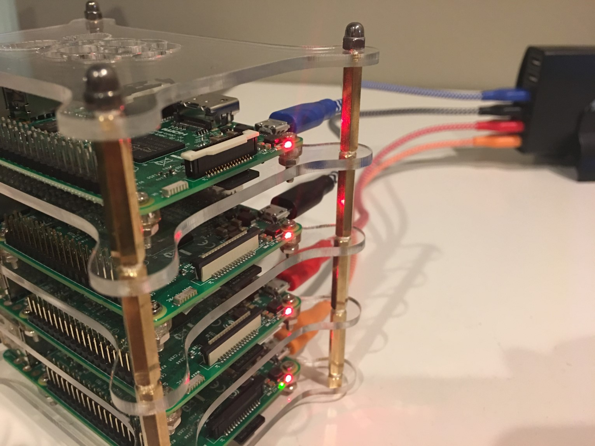

# acs-demos
Demo's for Azure Container Service.

## Big Little Challenge

This is a card game designed to demonstrate multicontainer applications running in 
different orchestrators with minimal changes.

## PiSwarm

PiSwarm is a hardware project to build a cluster of Raspberry Pis running Docker 
Swarm. Such a cluster can be used to demonstrate the ability to run these demo's 
in multiple environments. Showing the application running on Azure Container Service 
and a cluster of Raspberry Pis can sometimes be a powerful demonstration.

## Contribution

We welcome contributions in the form of documentation, bug reports,
feature requests, new features, code contributions, scripts,
screencasts and more. Please use the issue tracker and pull requests
to make your contributions.

## Code of conduct

This project has adopted the
[Microsoft Open Source Code of Conduct](https://opensource.microsoft.com/codeofconduct/). For
more information see the
[Code of Conduct FAQ](https://opensource.microsoft.com/codeofconduct/faq) or
contact [opencode@microsoft.com](mailto:opencode@microsoft.com) with
any additional questions or comments.
