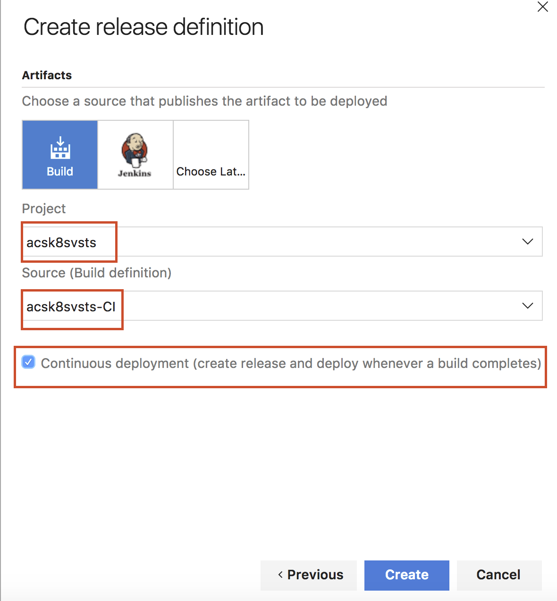

# Creating a CI/CD pipeline on Azure Container Services with Kubernetes and Visual Studio Team Services

## Overview

This article will demonstrate how to implement a continuous integration/continuous deployment pipeline for a multi-container app using Azure Container Service, Kubernetes and Visual Studio Team Services (thereafter mentioned as VSTS) Build and Release Management.

You will use a simple application which is available on [GitHub](https://github.com/dgkanatsios/acsk8svstsdemo) (heavily based on [this](https://github.com/azure-samples/container-service-dotnet-continuous-integration-multi-container) one) and is composed of three components, each of those hosted in its Docker container:

*   **service-a**: a Node.js app that serves as a web frontend  which connects to service-b and mycache
*   **service-b**: a .NET Core app that sends a simple text string to service-a that contains current machine's hostname
*   **mycache**: a [Redis](https://redis.io/) cache that holds an integer called "requestCount" which is set and requested by service-a

## Intro

At the end of this article, the application will be delivered via a CI/CD pipeline from a GitHub repository to a Kubernetes cluster running on Azure Container Service. Respective Docker images for service-a and service-b will be pulled from an Azure Container Registry service.

Here you can see a basic outline of the steps in the pipeline

1.  User commits some changes to a local git repository and pushes them to the remote one. This article uses GitHub, but feel free to choose whichever source control provider you like
2.  GitHub will trigger a new Build on VSTS by calling a VSTS webhook
3.  VSTS will pull the latest version of the application from GitHub
4.  VSTS will build Docker images service-a and service-b and push them to Azure Container Registry
5.  VSTS will adapt a YAML Kubernetes deployment file and drop it as a Build artifact and a new Release pipeline will be triggered. This deployment file will then be executed in the Kubernetes cluster
6.  Kubernetes cluster will pull service-a and service-b images from Azure Container Registry and execute the rest of the deployment file instructions (create public endpoints etc.)
7.  After the successful deployment, application is accessible via browser

As a sidenote, both service-a and service-b execute code that displays current machine hostname. Accessing the name of the host when inside a container will retrieve the container ID, which also is the case in our scenario.

## Prerequisites

Before you start, make sure you have the following

*   [A Kubernetes cluster deployed in Azure Container Service](https://docs.microsoft.com/en-us/azure/container-service/container-service-deployment)
*   [Install kubectl and get the relevant Kubernetes configuration for the cluster](https://docs.microsoft.com/en-us/azure/container-service/container-service-kubernetes-walkthrough#connect-to-the-cluster)
*   [Create an Azure Container Registry service](https://docs.microsoft.com/en-us/azure/container-registry/container-registry-get-started-portal)
*   [Create a VSTS account](https://www.visualstudio.com/en-us/docs/setup-admin/team-services/sign-up-for-visual-studio-team-services)
*   [Fork the demo app GitHub repository to your GitHub account](https://github.com/dgkanatsios/acsk8svstsdemo)
*   [Azure CLI](https://docs.microsoft.com/en-us/cli/azure/install-azure-cli)

## Configure VSTS Build definition

Create a new project in VSTS. This article uses the name "acsk8svsts" ([k8s is just another name for Kubernetes](https://kubernetes.io/docs/concepts/overview/what-is-kubernetes/#what-does-kubernetes-mean-k8s)). Go to your project in VSTS web app, then click Build &amp; Release on the top menu.

There, click on "+ New definition" button to create a new Build Definition. Select the "empty process" template to start from scratch.

You are presented with a new empty Build definition template. Click the "Get sources" task and configure GitHub as the source by providing your GitHub credentials. Moreover, configure the repository entry to point at your forked repository.

Now it is a good time to enable Continuous Integration for your forked repository. Click "Triggers" and enable Continuous integration. This way, each time there is a new push to your GitHub repository, a new Build on your VSTS project will be triggered.

Moreover, head to Options tab and configure the Default agent queue to be "Hosted Linux Preview", in order to use a Linux machine to perform the build.

Let's get back to the Tasks tab. Add a new "Docker" task.

Call it "Build service-a", or whichever name you see fit. As you can imagine, this task will be used to build the Docker image for the service-a application. Then, select your Azure subscription (you'll probably need to authenticate with your Azure credentials) and the Azure Container Registry you created. Leave the "Action" as "Build an image".

Select the Dockerfile in the service-a folder, leave "Use Default Build Context" checked and set the image name as service-a:$(Build.BuildId). With the "Qualify Image Name" option checked, the final image name will be **acrdns**.azurecr.io/service-a:**X** where "acrdns" is your Azure Container Registry service name and "X" will be the VSTS Build ID (just an auto-incremented integer). By tagging each image with a Build ID, it is easy to determine which VSTS Build created the specific image in your Azure Container Registry.

Next, add another Docker task. You will use this to push service-a image that was just built to your Azure Container Registry. Set the display name as "Push service-a", select your Azure Container Registry, pick "Push an image" as "Action" and set the name as service-a:$(Build.BuildId). Also, leave "Qualify Image Name" checked. Consequently, the image that will be pushed will be the image that was created in the "Build service-a" task.

You now need to add a "Command Line" task. This task is needed to build the .NET Core app. Use "bash" for the "tool" (as the execution takes place in a Hosted Linux agent) and use **-c "dotnet restore &amp;&amp; dotnet publish -c Release -o bin ."** as argument for the bash command. Do not forget to set "service-b" as the working folder as that is where the bash command should execute.

Since the .NET Core app was built, now it's the time to build the Docker image that contains it and push it to the registry. Again, add a Docker task, call it "Build service-b", select your Azure Container Registry, the "Build an image" action and the Dockerfile in the service-b folder.

Set the image name as "**service-b:$(Build.BuildId)**" and, as before, leave the "Use Default Build Context" and "Qualify Image Name" checkboxes checked.

Next, add another Docker task so that VSTS can push the image you just created to the Azure Container Registry. You should use similar options as the ones in the 'Push service-a' task.

So far, images for service-a and service-b have been built and pushed. The next task that needs to be done is a slight configuration to the deploy.yaml file that exists in the source code. The deploy.yaml file contains instructions regarding the deployment of the container images, the number of service-b container replicas as well as the necessary services (endpoints and ports). Add another command line task, use bash as the tool and **-c "sed -i 's/$BUILD_ID/$(Build.BuildId)/; s/$ACR_DNS/acrdns.azurecr.io/' deploy.yaml"** as argument (do not forget to replace acrdns with the name of your Azure Container Registry service).

The sed command will replace all instances of $BUILD_ID with the current VSTS BuildId and all the instances of $ACR_DNS with the address of your Azure Container Registry service.

Last build task will be to publish the transformed deploy.yaml file as a build artifact. This way, it can be used y the Release Definition you will create next. By using the values in the below picture, deploy.yaml file will be placed in the **deploy** folder (artifact name) in the **acsk8svsts-CI** (Build name) folder.

## Configure VSTS Release definition

Save (not Save &amp; Queue) your Build definition and click on the Releases link. There, click the "+ New definition" button to create a new release definition.

Select the "Deploy to Kubernetes cluster" template to get started. Click Next.

On the next screen, pick your project and the Build definition you previously created and tick the "Continuous deployment" checkox. This way, when a Build completes, a new Release pipeline will be triggered. Click Create.

On the next screen, feel free to change the Release definition name. Moreover, choose your Azure subscription and Azure Container Registry. Most importantly, you need to configure the Kubernetes Service Connection (i.e. the connection to your deployed Kubernetes cluster). Click Add on the "Kubernetes Service Connection" option.

You need to add the necessary information in order to connect to the Kubernetes cluster. First, pick a connection name. Then, you need to get the Master server URL. Try running "kubectl cluster-info" at your command prompt and get the URL of Kubernetes master. Finally, paste the entire content of your Kubernetes configuration file in the "Kubeconfig" field. Configuration file (most probably called **config**) can be found on ~/.kube/ folder (where ~ is your home directory). Click OK to accept your input.

You also need to configure the kubectl command. Go to the Commands option, use "apply" as the requested command and add "-f $(System.DefaultWorkingDirectory)\**BuildName\****ArtifactName\**deploy.yaml" to the arguments. Do not forget to provide your own values for BuildName and ArtifactName. If you have followed the example in the Build artifact creation, BuildName will have the value "acsk8svsts-CI" and ArtifactName will have the value "deploy".

Click Save. Your CI/DC pipeline is ready, congratulations!

##### Update (June 12th, 2017): If you're encountering "SPAWN Uknown" errors when running "kubectl apply" release command, try switching to "Hosted VS2017" Release Agent. To do this, click the "Run on agent" button on the above screen, select "Hosted VS2017" and save.

## Testing your CI/CD pipeline

To test your CI/CD pipeline, make some changes in your forked repository and push them to GitHub. If all works well, you will see a new Build being triggered which, in turn, will trigger a new Release. In the end, if you run "kubectl get pods" and "kubectl get services" commands you will get the following results:

**kubectl get pods**
NAME READY STATUS RESTARTS AGE
mycache 1/1 Running 0 59s
service-a 1/1 Running 0 1m
service-b-1191627191-bmt76 1/1 Running 0 1m

**kubectl get services**
NAME CLUSTER-IP EXTERNAL-IP PORT(S) AGE
kubernetes 10.0.0.1 443/TCP 16d
mycache 10.0.53.244 6379:30313/TCP 1m
service-a 10.0.248.14 80:32019/TCP 1m
service-b 10.0.77.83 80:30689/TCP 1m

Bear in mind that it might take some time for the service-a external IP to be created (that's why you'll see a result for the external IP), since Azure backend has to create a new external Load Balancer service and configure the necessary firewall rules.

When you get a public ip, try opening it on the browser. You should see a message that displays hostnames of both service-a and service-b applications. Try pressing "Say It Again" button a couple of times, you will see that Count variable is increased (remember that its value is persisted in Redis cache) and that service-b hostname remains the same, since there is only a single pod that contains the service-b application.

Go to the console and run "kubectl scale deployment service-b --replicas 3". This will scale the deployment service-b (that contains service-b container image) to 3 replicas (3 pods). Wait a bit, then try pressing "Say It Again" button again. You can now see that requests are served by 3 different containers.

## Next steps

*   To learn more about CI/CD with VSTS, check [here](https://www.visualstudio.com/docs/build/overview)
*   For more information regarding Kubernetes, check the official site [here](https://kubernetes.io/)
*   If you want to do CI/CD with Docker Swarm on Azure Container Service, check [here](https://docs.microsoft.com/en-us/azure/container-service/container-service-docker-swarm-setup-ci-cd) for the post that also served as an inspiration for this article