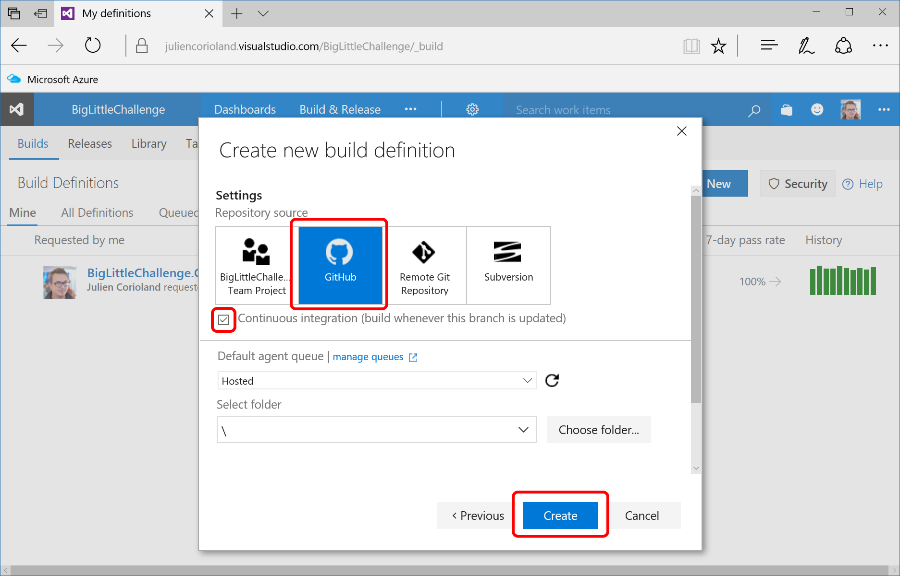

# Create a full CI/CD pipeline for Docker Swarm using Visual Studio Team Service

## Overview

In this training, you are going to create a full CI/CD pipeline to deliver continuous the [Big Little Challenge](../../incubator/BigLittleChallenge) application to a Docker Swarm cluster.

You are going to use:

- GitHub as the source code repository
- Visual Studio Team Services as the CI and CD system
- Azure Container Registry as the Docker Registry


## Prerequesites

Before starting to implement the CI/CD workflow, you need:

- [Create an Azure Container Registry](https://docs.microsoft.com/en-us/azure/container-registry/container-registry-get-started-portal)
- [Have a Visual Studio Team Services account and team project created](https://www.visualstudio.com/en-us/docs/setup-admin/team-services/sign-up-for-visual-studio-team-services)
- [Fork the ACS Demos repository to your GitHub account](https://github.com/azure/acs-demos)
- [Deploy a Docker Swarm mode cluster to Microsoft Azure](../swarm/deploy-acs-engine.md)

## Configure your Visual Studio Team Service account

### Install the Docker Integration extension

Microsoft provides a VSTS extension to work with Docker in build and release processes. This extension is available in the [Visual Studio Marketplace](https://marketplace.visualstudio.com/items?itemName=ms-vscs-rm.docker). Click **Install** to add this extension to your VSTS account:


You are asked to connect to your VSTS account using your credentials.

### Connect Visual Studio Team Services and GitHub

Set up a connection between your VSTS project and your GitHub account.

1. In your Visual Studio Team Services project, click the **Settings** icon in the toolbar, and select **Services**


2. On the left, click **New Service Endpoint** > **GitHub**


3. To authorize VSTS to work with your GitHub account, click **Authorize** and follow the procedure in the window that opens


### Connect Visual Studio Team Services and Azure Container Registry

In the Services settings of your Visual Studio Team Services project, add a service endpoint of type **Docker Registry**.
In the popup that opens, enter the URL and the credentials of your Azure container registry:


Your VSTS account is now configured. You are now ready to create a new build definition.

## Create a new build definition

In this part, you are going to create a new build definition to trigger a CI build each time an udpate is done on the source code of the Big Little Challenge application. 
This continuous integration will be reponsible for:

- Build each Docker image that composes the application
- Push each Docker image that has been built into the Azure Container Registry
- Generate a docker-compose.yml file with the new version of the Docker images to use
- Publish the docker-compose.yml file as an output artefact
- Trigger a new deployment using VSTS Release Management

On the VSTS portal, go into the Build & Release section of your team project and click **+ New** to create a new build definition:


Choose to start from an empty template:


Click next and select **GitHub** on the next screen. Make sure to check the **Continuous Integration** checkbox:




First, you need to configure which source code repository you want to build during the CI process. Go in the **Repository** tab and make sure to select the fork of the **acs-demos** repository that you have created in your GitHub account in the prerequisites:


Then, go in the **Variables** tab and add a new variable with the URL of your Azure Container Registry. You can name it *Docker.RegistryUrl*:


*Notes:*

*Docker has a simple rule to determine the repository where you want push/pull images. You just have to make the image name starting with either your Docker Hub identifier or the URL of the private repository you want to use.*

*For example, in my personal case, my Docker Hub identifier is **jcorioland**, so if I want to push an image to my account, I need to prefix its name with **jcorioland/**.*

*I also have an Azure Container Registry, that is hosted on **jcorioland-microsoft.azurecr.io**. If I want to push or pull images to and from this private registry, I need to prefix their names with **jcorioland-microsoft.azurecr.io/**.*


Now, go in the **General** tab and make sure that you choose the **Hosted Linux Preview** default agent queue and set the Build number format to *$(Date:yyyyMMdd)$(Rev:.r)*. 
It will be used to tag the Docker images that you are going to build)


Click the **Save** button, to save your modifications. As it is the first time you save it, you will be asked for a name and a description.

Now that you are back in the **Build** tab, you are going to define the CI workflow. This workflow is composed by 12 occurrences of the **Docker** tasks, as you need to build, tag and push 4 Docker images for the BigLittleChallenge application (trials-base, trials-engine, trials-engine-dashboard and trials-ai.

To add the Docker tasks, click **+ Add build step…** and look for the **Docker** entry in the list. Then click **Add** (12 times...):


For each image, you need to configure a task to build the image, a task to tag the image with your registry URL and the build number as a tag and a task to push the image:

**Build an image:**


You need to fill:

- The registry connection
- The action: **Build an image**
- The location of the Dockerfile for the image you are building (you can use the … button to browse the source code)
- The build context: fill it with incubator/BigLittleChallenge to indicates to the Docker engine than the build context is the BigLittleChallenge folder
- The image name

Do the same for the four images:

- biglittlechallenge/trials-base
- biglittlechallenge/trials-engine
- biglittlechallenge/trials-engine-dashboard
- biglittlechallenge/trials-ai

**Tag an image:**


You need to fill:

- The registry connection
- The action: **Run a Docker command**
- The Docker command you want to run: the TAG command: 
    - The first parameters is the name of the image you have built (ex: biglittlechallenge/trials-base)
		- The second parameters is the tag of the image you want to push. The pattern is: $(Docker.RegistryUrl)/IMAGE_NAME:$(Build.BuildNumber)

*Note:*

***$(Docker.RegistryUrl)** and **$(Build.BuildNumber)** are builds variables that will be replaced at build time by VSTS.*

Do the same for the four images:

- biglittlechallenge/trials-base
- biglittlechallenge/trials-engine
- biglittlechallenge/trials-engine-dashboard
- biglittlechallenge/trials-ai

**Push an image:**


You need to fill:

- The registry connection
- The action: **Push an image**
- The name of the image you want to push (same pattern that the one you used for the tag step)

Do the same for the four images:

- biglittlechallenge/trials-base
- biglittlechallenge/trials-engine
- biglittlechallenge/trials-engine-dashboard
- biglittlechallenge/trials-ai

At the end, you should have for each image, three Docker tasks: one for build, one for tag and one for push:


Click the **Save** button, to save your modifications.

## Running your first Docker CI

Now that you have defined the whole build workflow, you can test it!
Click on **Queue new build**, make sure that the **Hosted Linux Agent** queue is selected and click  to start the build:


Wait for the build to be completed (it will take a bit of time, so you can go to the next part to create the release definition while it is building!)


## Deploying the application continuously

### Docker Compose

Deploying an application on Swarm mode is really easy. The only thing you need is to define a Docker compose file that defines the containers that compose the application and how they need to be configured (ex: the ports they are running on, the number of replicas, the dependencies between each other…)

In the source code repository, you will find a **swarmmode** folder in the [**BigLittleChallenge**](../../incubator/BigLittleChallenge) directory. This folder contains a file named **docker-compose.yml.template**:

```yaml
version: '3'
networks:
  trials:
    driver: overlay
services:
  engine:
    image: REGISTRY_URL/biglittlechallenge/trials-engine:BUILD_NUMBER
    networks:
      - trials
    ports:
      - "8080:8080"
    environment:
      MIN_NUMBER_OF_PLAYERS: 5
    deploy:
      mode: replicated
      replicas: 1
  aiplayer:
    image: REGISTRY_URL/biglittlechallenge/trials-ai:BUILD_NUMBER
    networks:
      - trials
    ports:
      - "8888"
    depends_on:
      - engine
    deploy:
      mode: replicated
      replicas: 5
  dashboard:
    image: REGISTRY_URL/biglittlechallenge/trials-engine-dashboard:BUILD_NUMBER
    networks:
      - trials
    ports: 
      - "8181:80"
    depends_on:
      - engine
    deploy:
      mode: replicated
      replicas: 1
```

It defines how the Big Little Challenge application should be run on Swarm mode. But before being able to ask Swarm to deploy the application, we need to replace the two variables that are defined inside:

- **REGISTRY_URL** to be replaced by your own registry URL
- **BUILD_NUMBER** to be replaced by the latest build number to match with an image that has been pushed

And you are going to ask the VSTS to do it automatically for you at the end of the build.

### Update the build definition

Go back in the build definition and add two more build steps using the **Command Line** task:


Then you can use **sed** to replace the token in the Docker compose template by the $(Docker.RegistryUrl) and $(Build.BuildNumber) build variables:


To replace BUILD_NUMBER, use:

```bash
-c "sed -i 's/BUILD_NUMBER/$(Build.BuildNumber)/g' incubator/BigLittleChallenge/swarmmode/docker-compose.yml.template"
```

To replace REGISTRY_URL, use:

```bash
-c "sed -i 's/REGISTRY_URL/$(Docker.RegistryUrl)/g' incubator/BigLittleChallenge/swarmmode/docker-compose.yml.template"
```

Add a third Command Line task to move the template file to a docker-compose.yml file:


And finally, you need to publish this brand new **docker-compose.yml** file as an output artifact for this build. By doing this, you make sure that the file will be available for the release process.

To do that, add a new build step that uses the **Publish Build Artifacts** task:


And configure it to produce the docker-compose file as a server artifact:


Click **Save** and queue a new build. Wait for the build to be completed.
Once successfully completed you should see an **Artifacts** tab on the summary page. Click on it and explore the output folder that should contain the generated **docker-compose.yml** file:


## Create a new Release Definition

Now that the build process produces the docker-compose.yml file that is needed to run the new version of the application, you can go in the Release section of your VSTS team project and create a release definition:


Choose to start from an empty template. Click **Next**.
On the next screen, make sure to select your team project, the build definition you have created, checking the continuous deployment checkbox and selecting the **Hosted Linux Preview** as an agent queue:

vsts-release-workflow.pngvsts-release-new-build.png)


By selecting those settings you will make sure that each time a build is completed successfully, the release process will be triggered automatically and run onto a Linux machine.

Click **Create** to create the release definition.

This release is composed by two tasks:

- The first one uses SCP to copy the compose file on the Swarm master, using SSH
- The second one to execute a command over SSH to ask Swarm to run the application


Click on the **Manage** link to declare a new SSH Endpoint in your project.
In the window that opens, click **New Service Endpoint** and search for **SSH** in the list:


Fill the form with the information required to SSH into your Swarm master and click OK.
Then you can go back on the release definition and click refresh to be able to select the SSH Endpoint you have created.

Click on the **…** button to choose the Source folder and select the **output** folder available in the artifacts from the build:


Then give a name for the target folder on the Swarm master:


The second task executes a bash command on the master to create the Docker stack and run the application, from the docker-compose.yml file:


Here is the command line to run:

```bash
docker login -u $(Docker.Username) -p $(Docker.Password) $(Docker.RegistryUrl) && docker stack rm biglittlechallenge && docker stack deploy biglittlechallenge -c output/docker-compose.yml --with-registry-auth
```

As you can see, it is nothing else but executing a bunch of Docker commands!


Finally, you need to add three variables for the release, the username, password and URL of your Azure Container Registry:


Name your release definition and click **Save**.

Now you can test this new release by clicking **Release** > **Create new release** and select the build number to deploy.

Wait for the release to be completed.
Then you have to wait for the deployment to be completed on the server (the time to pull the new images from the registry).

If you want to see what is going on the cluster, create an SSH tunnel as learned before and do a **docker service ls** command:


And you are done !
Now if you update any piece of code in the GitHub repository, the CI will automatically be triggered to build, tag and push the images and a release will be executed to deploy the new version of the application!