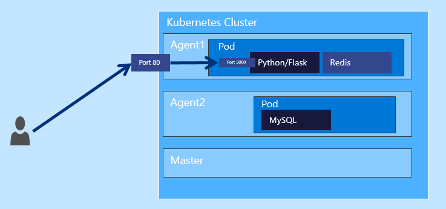
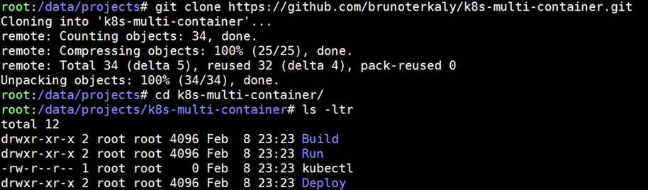

# Lab guide: Step-by-Step - Building a Web Service backed by a REDIS cache and MySQL Database on Kubernetes

Introduction

- This is a step-by-step lab that will guide you to building out a web service that runs on Kubernetes.
- The technologies for the web service includes Python and Flask.
- A REDIS caching layer is employed in addition to a MySQL database

**Video Presentations of this lab can be found here:**

https://www.youtube.com/channel/UCsBCIVK2c_YqxRQFX6xfYJw/videos?shelf_id=0&view=0&sort=dd

You can see in the diagram below that VM is represented by an agent, both agent 1 and agent 2. Notice further that on each agent a pod is running.

The first pod is running both the **web service**, represented by Python and flask, as well as the **caching service** (REDIS). It makes sense to **bundle those two together** on the same pod so as to minimize latency.

The caching service saves round-trips to the database. if the data is in the cache, then the database does not need to get involved.

Notice that the user will come in on **Port 80** when accessing the web service from the outside world. But the actual requests get routed to port 5000 in the Python flask web service, which is listening really on port 5000.

_Figure 1: Overview_

## Part 1 - Introduction

Let's recap the technology stack used in these labs:

This service will have some core characteristics.

- The application will run in the Azure Container Service (ACS) as a K8s cluster
- ACS + Kubernetes will host a web service (Python + Flask)
- There is:
	- A caching layer (Redis)
	- A backend database of MySQL
	- Two pods
		- The first pod will have both the web service and the caching layer
		- The second pod will have a MySQL database

### Prerequisites

Before getting started, make sure that you have a Kubernetes cluster created. You will also need to verify that the **kubectl** utility works correctly. You will need to download the **config** file, which is what allows the **kubectl** to properly connect up to the Kubernetes cluster.

You will not need to specifically SSH into the Kubernetes cluster. But you will need a development machine that has the appropriate SSH keys that allows communication with the Kubernetes cluster.

I have created a couple of videos to illustrate how to get that set up. There is some overlap in these videos, but taken together they show you how to install all the necessary tooling to get up and running, even provisioning the cluster itself within Azure.

- Video 1
	- https://www.youtube.com/watch?v=qW6mzCJg4tI
- Video 2
	- https://www.youtube.com/watch?v=2316KyERwvg

----------

### Test your knowledge

*Do you know what a Kubernetes pod is?*

> **Pod: ** A pod (as in a pod of whales or pea pod) is a group of one or more containers (such as Docker containers), the shared storage for those containers, and options about how to run the containers. 
> 
> **Pods** are always **co-located and co-scheduled**, and run in a shared context. 
> 
> A pod models an application-specific “logical host” - it contains one or more application containers which are relatively tightly coupled — in a pre-container world, they would have executed on the same physical or virtual machine.

> While Kubernetes supports more container runtimes than just Docker, Docker is the most commonly known runtime, and it helps to describe pods in Docker terms.

> The shared context of a pod is a set of Linux namespaces, cgroups, and potentially other facets of isolation - the same things that isolate a Docker container. Within a pod’s context, the individual applications may have further sub-isolations applied.

> Containers within a pod share an IP address and port space, and can find each other via localhost. They can also communicate with each other using standard inter-process communications like SystemV semaphores or POSIX shared memory. Containers in different pods have distinct IP addresses and can not communicate by IPC.

----------

## Part 2 - Getting the code

The prerequisite to this session is the fact that you have a Kubernetes cluster already provisioned.

[    https://www.youtube.com/channel/UCsBCIVK2c_YqxRQFX6xfYJw/videos?shelf_id=0&view=0&sort=dd](https://www.youtube.com/channel/UCsBCIVK2c_YqxRQFX6xfYJw/videos?shelf_id=0&view=0&sort=dd "Prequisites Link")

### Downloading the source code

Click this link below for the source code:

[https://github.com/brunoterkaly/k8s-multi-container](https://github.com/brunoterkaly/k8s-multi-container)

#### Lab Instructions

1. Download the source code for this lab.

The command download is:

	git clone https://github.com/brunoterkaly/k8s-multi-container.git

Here is the output:

_Figure 2: Cloning the source code_

You will notice that there are three folders:

- **Build** (contains the Python code to build out our web service)
- **Deploy** (Contains the YML definition file that lets us set up our pods, services, and our containers in Kubernetes)
- **Run** (contains the commands to deploy, operate, and manage our Kubernetes cluster)

Below you will find the folder structure that was addressed above.

_Figure 3: The files and folders used in this lab_

----------

## Part 3 - Building the web service

In this section we will focus on building out the web service, focusing on the Python code. We will also build out the docker image that will run in the agents of the Kubernetes cluster. We will review the Python file, Flask and some other pieces.

- The **web service** is a combination of Python and Flask
- **Python** represents the main programming paradigm and **Flask** as the necessary libraries to expose endpoints as web services
- **dockerfile** is used to build out our image, which will then be uploaded to hub.docker.com
- **app.py** represents the Python application that implements web services
- **buildpush.sh** is some script code to do both the building of the image, as well as the uploading of the image to hub.docker.com

----------

### Test your knowledge

*Do you know what Flask is?*

> Flask is a web framework. This means flask provides you with tools, libraries and technologies that allow you to build a web application. This web application can be some web pages, a blog, a wiki or go as big as a web-based calendar application or a commercial website.
> 
> Flask is part of the categories of the micro-framework. Micro-framework are normally framework with little to no dependencies to external libraries. This has pros and cons. Pros would be that the framework is light, there are little dependency to update and watch for security bugs, cons is that some time you will have to do more work by yourself or increase yourself the list of dependencies by adding plugins.

The Python application is a web service that listens on port 5000.a number of URLs with differing endpoints will map to specific methods within the **app.py** file.

_Figure 4: Working on the Python App_

---------- 

#### Test your knowledge

*Do you know what a Dockerfile is?*

> **Dockerfile: ** Docker can build images automatically by reading the instructions from a Dockerfile. A Dockerfile is a text document that contains all the commands a user could call on the command line to assemble an image. Using docker build users can create an automated build that executes several command-line instructions in succession

#### The Dockerfile

Before diving into the details of the app.py, let's talk about the environment in which it will run.

It all wrong inside of a docker container. Docker containers is the execution of a docker image.

- Represents the image blueprint for our docker container
- Listening on port 5000
- Starts up running **app.py**

**Dockerfile**

	FROM python:2.7-onbuild
	EXPOSE 5000
	CMD [ "python", "app.py" ]

Notice of the docker file above that **FROM python:2.7-onbuild** represents the base image that comes preconfigured with all the Python dependencies that are needed. That is the beauty of the docker ecosystem. You can start with an existing Python image that has flask installed.

There are a few things to notice:
- Port 5000 was exposed for the container so that incoming requests can be serviced
- CMD [ "python", "app.py" ] tells the system to run the **ap.py** file when the container starts.

#### Lab Instructions

1. Go to the Build directory
2. Open **Dockerfile**
3. Make sure that you understand the contents of the **Dockerfile**

Type these commands:

	cd Build
    vim Dockerfile

**app.py** represents the main web service. It imports a variety of libraries. Let's present the code then review it.

#### Lab Instructions

Here is how to view **app.py**.

1. Go to the **Build** directory
2. Open **Dockerfile**
3. Make sure that you understand the contents of the **app.py**

	cd Build
    vim app.py

---------- 

#### Test your knowledge

*Do you know what a Flask route is?*

> **Flask Route: ** As you wil see below, the route() decorator is used to bind a function to a URL. Here is a basic examples:

	@app.route('/hello')
	def hello():
	 return 'Hello, World'

---------- 

Notice that our example below for Flask has many more routes:

**app.py**

	from flask import Flask
	from flask import Response
	from flask import request
	from redis import Redis
	from datetime import datetime
	import MySQLdb
	import sys
	import redis 
	import time
	import hashlib
	import os
	import json
	
	app = Flask(__name__)
	startTime = datetime.now()
	R_SERVER = redis.Redis(host=os.environ.get('REDIS_HOST', 'redis'), port=6379)
	db = MySQLdb.connect("mysql","root","password")
	cursor = db.cursor()
	
	@app.route('/init')
	def init():
	    cursor.execute("DROP DATABASE IF EXISTS AZUREDB")
	    cursor.execute("CREATE DATABASE AZUREDB")
	    cursor.execute("USE AZUREDB")
	    sql = """CREATE TABLE courses(id INT, coursenumber varchar(48), 
	                  coursetitle varchar(256), notes varchar(256));  
	     """
	    cursor.execute(sql)
	    db.commit()
	    return "DB Initialization done\n" 
	
	@app.route("/courses/add", methods=['POST'])
	def add_courses():
	
	    req_json = request.get_json()   
	    cursor.execute("INSERT INTO courses (id, coursenumber, coursetitle, notes) VALUES (%s,%s,%s,%s)", 
	          (req_json['uid'], req_json['coursenumber'], req_json['coursetitle'], req_json['notes']))
	    db.commit()
	    return Response("Added", status=200, mimetype='application/json')
	
	@app.route('/courses/<uid>')
	def get_courses(uid):
	    hash = hashlib.sha224(str(uid)).hexdigest()
	    key = "sql_cache:" + hash
	    
	    returnval = ""
	    if (R_SERVER.get(key)):
	        return R_SERVER.get(key) + "(from cache)" 
	    else:
	        cursor.execute("select coursenumber, coursetitle, notes from courses where ID=" + str(uid))
	        data = cursor.fetchall()
	        if data:
	            R_SERVER.set(key,data)
	            R_SERVER.expire(key, 36)
	            return R_SERVER.get(key) + "\nSuccess\n"
	        else:
	            return "Record not found"
	
	if __name__ == "__main__":
	    app.run(host="0.0.0.0", port=5000, debug=True)

#### Understanding app.py

There are 3 endpoints that the web service responds to:
- http://[Kubernetes Cluster IP Address]/**init**
- http://[Kubernetes Cluster IP Address]/**add**
- http://[Kubernetes Cluster IP Address]/**courses/{course id}**
	- The user passes in the {course id}

The code is self explanatory, but here are some high level tips.

Expose the "init" endpoint
- The user will hit http://[Kubernetes Cluster IP Address]/**init**
- The result is to setup the database (create database, tables, etc)
- Initially, we will use an internal IP address, later moving to a public IP address

Expose the "add" endpoint
- The user will hit http://[Kubernetes Cluster IP Address]/courses/**add**
- Performs an insert into the database using the data posted by the user
- POST is the HTTP verb being used

Expose the "courses/{course id}" endpoint
- The user will hit http://[Kubernetes Cluster IP Address]/**courses**/**{course id}**
- This allows the user to query the endpoint
- It will return records from either the cache or the database
- If the data is not in the cache, it will be retrieved from the database, put into the cache, and returned to the client

#### Lab Instructions

Let's build the Docker image and upload to hub.docker.com.

1. Go to hub.docker.com and establish an account. You will need it to upload docker images. The account used in these demos is **brunoterkaly**. See "Example Account" below.
2. Go to the Build directory
2. Open **buildpush.sh**
	1. This is a shell script that builds the docker image and pushes image to hub.docker.com
3. Make sure that you understand the contents of the **buildpush.sh**
4. Run buildpush.sh

Commands to view and run buildpush.sh

	# View buildpush.sh
	cd Build
    vim buildpush.sh
	# Run buildpush.sh
	bash buildpush.sh

Remember to go to hub.docker.com and create your own account. As you can see, I chose "brunoterkaly" as the owner of my repos on hub.docker.com. 

So you will then edit "brunoterkaly" below to reflect YOUR hub.docker.com account.

#### buildpush.sh

	# Make sure to run as "root" or use "sudo"
    # Don't forget "brunoterkaly" will not work for you
    # Use the one you created at hub.docker.com
	sudo docker build . -t brunoterkaly/py-red
    # You may need to do a "docker login" command for the command below to work
	sudo docker push brunoterkaly/py-red

#### Run **buildpush.sh**

	bash buildpush.sh

_Figure 5: Example Account_

#### Output of buildpush.sh

_Figure 6: Example of running buildpush.sh_

You should be able to see the the image available on hub.docker.com.

_Figure 7: hub.docker.com - Our image is ready for download_

----------

## Part 4 - Understanding the YAML files

Kubernetes uses a declarative markup language inside of YAML file to define the way containers run inside of pods as well as how these containers are exposed to the outside world through a service layer, which exposes either private or public IP address. There will be three categories of the YAML files. The first while YAML file will define a pod in which the both the Python application as well as the REDIS cache. The second YAML file is used to define how the MySQL database will run in its own pod. And the third YAML file will be used to expose the endpoint in the Python web service with either private or public IP address.

Before you get here, make sure you have issued the "docker build" and "docker push" commands reflected above.

Here is some information about pods and containers. Some of this reiterates what was just said above.

- These YAML files define the way our containers will run in the Kubernetes cluster
- They also define how the containers are organized within pods
- Pods group together containers in the same host
- This provides efficiency in that the containers are running close together
- As described, there are two pods
- On the first pod there will be two containers, the Python web service and the Redis Cache
- On the second pod there will be the MySQL database
- YML files just text file that define the pods and the services
- The first part is called the 'web' pod 

#### Lab Instructions

We will now go and opened the three YAML files and look inside of them to see how they are constructed.

1. Change directory to the **Deploy** directory (**cd Deploy**)
2. Execute **vim web-pod-1.yml**.
3. Review the contents.
	1. You will notice that there are two images that make up the pod
		1.  REDIS (using the one already built and available at hub.docker.com)
		2.  py-red (the one we just built in a prior section of this lab)
		1.  understand the other metadata that you see there, such as the container port, the labels and names used.

#### web-pod-1.yml

Defines the pod for the web part of the application.

Anytime you see "brunoterkaly," you need to replace that with your own account name at hub.docker.com.

	apiVersion: "v1"
	kind: Pod
	metadata:
	  name: web1
	  labels:
	    name: web
	    app: demo
	spec:
	  containers:
	    - name: redis
	      image: redis
	      ports:
	        - containerPort: 6379
	          name: redis
	          protocol: TCP
	    - name: python
	      image: brunoterkaly/py-red
	      env:       
	        - name: "REDIS_HOST"
	          value: "localhost"
	      ports:
	        - containerPort: 5000
	          name: http
	          protocol: TCP                    

#### Lab Instructions

In this section we will understand the database layer. Once again, you will notice that we are using one of the images of at hub.docker.com that is specific for MySQL. Let's note that when we use these YAML files, those images will be downloaded automatically onto our Kubernetes cluster from hub.docker.com.

When we complete this section you will now understand the two pods that are running inside of the Kubernetes cluster. It makes sense that we would want to group the Python web service with the REDIS cache on the same pod to minimize latency.

1. Change directory to the **Deploy** directory(**cd Deploy**)
2. Execute **vim db-pod.yml**.
3. Review the contents.
	1. You will notice that there is just one image that is included in this pod
	2. It is the MySQL database
2. Execute **vim db-svc.yml**.
3. Review the contents.
	1. There are no references to images in this YAML file as its main purpose is to simply expose the pods and map incoming ports to the container
	2. Notice that when an incoming request comes on port 3306, it gets routed to port 3306 for the MySQL database

#### db-pod.yml

	apiVersion: "v1"
	kind: Pod
	metadata:
	  name: mysql
	  labels:
	    name: mysql
	    app: demo
	spec:
	  containers:
	    - name: mysql
	      image: mysql:latest
	      ports:
	        - containerPort: 3306         
	          protocol: TCP
	      env: 
	        - 
	          name: "MYSQL_ROOT_PASSWORD"
	          value: "password"

#### db-svc.yml

	apiVersion: v1
	kind: Service
	metadata:
	  name: mysql
	  labels:
	    name: mysql
	    app: demo  
	spec:
	  ports:
	  - port: 3306
	    name: mysql
	    targetPort: 3306
	  selector:
	    name: mysql
	    app: demo

#### Lab Instructions

In this third section  of YAML files. We will discuss how we would make the web service pod accessible through the use of a **service**. You have probably notice that there is a YAML entry called **kind**, which indicates the type of Kubernetes object. We would like to instantiate. There are several, but for this lab we are focusing on **pod** in-**service**.

1. Change directory to the **Deploy** directory (**cd Deploy**)
2. Execute **vim web-svc.yml**.
3. Review the contents.
	1. There are no references to images in this YAML file as its main purpose is to simply expose the pods and map incoming ports to the container
	2. notice that when an incoming request comes on port 80, it gets routed to port 5000 for the Python and REDIS pod

> **NodePort:** Exposes the service on each Node’s IP at a static port (the NodePort). A ClusterIP service, to which the NodePort service will route, is automatically created. You’ll be able to contact the NodePort service, from outside the cluster, by requesting <NodeIP>:<NodePort>.

#### web-svc.yml
                          

            
	apiVersion: v1
	kind: Service
	metadata:
	  name: web
	  labels:
	    name: web
	    app: demo
	spec:
	  selector:
	    name: web 
	  type: NodePort
	  ports:
	   - port: 80
	     name: http
	     targetPort: 5000
	     protocol: TCP

#### db-svc.yml

	apiVersion: v1
	kind: Service
	metadata:
	  name: mysql
	  labels:
	    name: mysql
	    app: demo  
	spec:
	  ports:
	  - port: 3306
	    name: mysql
	    targetPort: 3306
	  selector:
	    name: mysql
	    app: demo
	
----------

## Part 6 - Getting started with kubectl

Previously we discussed some videos to help you get set up. As part of that set up process. We need to get a configuration file onto a developer computer so that it can appropriately communicate with the Kubernetes cluster. That is done through a **config** file.

For the sake of completeness, here are some commands to get that done.

### Getting the 'config' file

- We will use the Python and Azure SDK's to retrieve this file
- It will put it in a special folder from which we will copy it into the current directory

The videos outlined at the beginning of this document describe how to set up your Kubernetes cluster on Azure. The videos also cover:
- Getting the **config** file
- Getting the **kubectl** command

Here are some examples of commands to create the Kubernetes cluster using Python. You do not need to do these commands as this lab assumes you have a Kubernetes cluster.

	az login
	az account set --subscription "c884f[your subscription ID goes here]2fa28"
	# See Output 1
	az ad sp create-for-rbac --role="Owner" --scopes="/subscriptions/c884f3c[your subscription ID goes here]42fa28"
	# See Output 2
	RESOURCE_GROUP=ascend-k8s-rg
	DNS_PREFIX=ascend-k8s
	SERVICE_NAME=ascend-k8s-svc
	az group create \
            --name $RESOURCE_GROUP \
                --location "centralus"
	RESOURCE_GROUP=ascend-k8s-rg
	DNS_PREFIX=ascend-k8s
	CLUSTER_NAME=btk8s
	az acs create --orchestrator-type=kubernetes \
	         --resource-group $RESOURCE_GROUP \
	         --name=$CLUSTER_NAME --dns-prefix=$DNS_PREFIX
	az acs kubernetes get-credentials --resource-group=$RESOURCE_GROUP --name=$CLUSTER_NAME

Note that you will need to substitute your own information for what you see above. For example, the subscription ID you see will need to be your own.

Anytime you see the commands include, "az acs" you should realize that this involves the Azure and Python SDK to be installed on your developer computer.

You will also need to take special note with some of the environment variables you see above, substituting your own names as indicated below.

#### Notes about the code snippet above

You can get more information about provisioning your own Kubernetes cluster here in addition to the videos previously presented:

https://docs.microsoft.com/en-us/azure/container-service/container-service-kubernetes-walkthrough

### Setting environment variable (KUBECONFIG) and getting kubectl

This environment variable is used by kubectl to know where to retrieve the config file.

#### Lab Instructions

1. Run the **export** command as seen below for KUBECONFIG
	1. You can add this to **~/.bashrc** for a more permanent solution
2. Run the **az acs kubernetes install-cli** as seen below, in addition to the test specified
3. Review the following URLs for more information:
	1. https://www.youtube.com/watch?v=qW6mzCJg4tI
	2. https://www.youtube.com/watch?v=2316KyERwvg

Here is the command that allows the system to find your **config** file

	export KUBECONFIG=`pwd`/config

We will also want to get the **kubectl** utility, which is the mechanism we can use to communicate with their Kubernetes cluster. It works in conjunction with the **config** file just addressed.

	# obtain the kubectl utility
	az acs kubernetes install-cli
	# test the utility
	kubectl cluster-info

You can see the config file below being copied to the current working directory. You probably want to think about a more permanent location for the config file longer-term, but for now let's just copy it to a local directory for ease of use.

It's important to note that it's this config file that will enable us to communicate with the Kubernetes cluster from our Linux VM.

_Figure 8: Verifying config_
 
----------

## Part 7 - Using kubectl to run containers, provision pods, and provision services

We have now laid the groundwork for using kubectl. This means that we can begin to communicate with the cluster and indicate to the cluster which containers we wish to run in which pods and how to expose the pods through services.

It saves lots of time to have tab completion, you can enable it with:

    source <(kubectl completion bash)
	
Now you can hit tab to get completion suggestions, for example:

	kubectl (shows "get", "logs", "describe", etc)
	kubectl get pods (shows pods in the default namespace)
	kubectl get pods --namespace kube-system (shows pods in kube-system namespace).

So that I do not have to type **kubectl** over and over, I have run this following command in Linux to create an alias:

	alias k=kubectl

This means I can just use **k** instead of **kubectl**. 

To test that things are working correctly you can use the kubectl command to get information about the cluster, as follows:

	kubectl cluster-info
	#or
    k cluster-info

If everything is working correctly, you should see the following:

_Figure 9: Information about your cluster_

### Running the pods and services

At this point we are going to run the pods and services. You will find a file called **run.sh**. this file is simply encapsulating the running of four YAML files with the kubectl utility. They can be run in any order. But you can see that we are running a pod, then a service, one set of commands for the web layer and one set of commands for the database layer. 

#### Lab Instructions

The next step is to run our pods in our services, leveraging the **kubectl** utility.

1. Change directory to the **Deploy** directory (**cd Deploy**)
2. Execute **vim run.sh**.
3. Validate that it resembles the script defined below.
4. Exit out of **run.sh**.
5. At the command prompt, issue a **bash run.sh** command.

#### run.sh

	kubectl create -f db-pod.yml
	kubectl create -f db-svc.yml
	kubectl create -f web-pod-1.yml
	kubectl create -f web-svc.yml

The output of the command should look something like this:

_Figure 10: Running run.sh_

Once all the pods and services are running in the cluster, you can issue other commands to actually see the running pods and services.

Command to list running pods:
	
	kubectl get pods

Command to list running services:

	kubectl get svc

_Figure 11: Viewing the pods and services at the command line_

### Exposing the web service through an external IP address

Let's imagine that we want to open up this web service so that others can access it. This requires us to open up an external IP address. Notice that in the diagram, "Viewing the pods and services at the command line," the external address for the **web** component reads **<nodes>**. 

#### Lab Instructions

What will do in the next step is actually create a real external IP address that allows us to get access to the Python web service.

1. At the command line, type in **kubectl edit svc/web**
2. Navigate down two line 28 where you will see the **type** field, and replace **NodePort** with **LoadBalancer**.
	1. See figure, "Exposing an external IP address"

_Figure 12: Exposing an external IP address_

Command to expose an external IP address for our Web service:

	kubectl edit svc/web

Editing the web service file should look like this. nnotice that we did switch the  **type ** element to **LoadBalancer**.

	# Please edit the object below. Lines beginning with a '#' will be ignored,
	# and an empty file will abort the edit. If an error occurs while saving this file will be
	# reopened with the relevant failures.
	#
	apiVersion: v1
	kind: Service
	metadata:
	  creationTimestamp: 2017-02-15T22:00:51Z
	  labels:
	    app: demo
	    name: web
	  name: web
	  namespace: default
	  resourceVersion: "149793"
	  selfLink: /api/v1/namespaces/default/services/web
	  uid: 36eee4e7-f3ca-11e6-a3cd-000d3a9203fe
	spec:
	  clusterIP: 10.0.73.141
	  ports:
	  - name: http
	    nodePort: 30189
	    port: 80
	    protocol: TCP
	    targetPort: 5000
	  selector:
	    name: web
	  sessionAffinity: None
	  type: LoadBalancer
	status:
	  loadBalancer:
	    ingress:
	    - ip: 13.89.230.209

## Part 8 - Testing the application

Our application is now running in the Kubernetes cluster. In this next section we will run some commands to test it out. First, we will initialize the database. second, we will add some data to the database. And in the third section, we will actually test the queries and make sure that they leverage the REDIS cache, before actually hitting the underlying MySQL database.

**Understanding the three Python routes**

- In the last section we even exposed an external IP address, allowing us to  pretty much access web service from anywhere.
- As you recall, there are three endpoints that we can use to access the web service.
- The three routes:
	- init
	- couses/add
	- courses/{course id}

	http<nolink>://XXX/init
	http<nolink>://XXX/courses/add
	http<nolink>://XXX/courses/{course id}

#### Lab Instructions

The testing process starts by initializing the database. 

1. Return back to the Linux command prompt.
2. Type in **curl http://[public IP address the service]/init**
	1. See the command below for details

---------- 

#### kubectl get svs

In order to retrieve the external IP address, type:

	kubectl get svc

_Figure 13: Requesting a list of running services_

Once we have this at IP address, we can begin to write requests into our Python web service. you will notice the response from the system, saying, **DB Initialization done**.

	curl 40.69.141.235/init

_Figure 14: Initializing the database with the curl command_

As you recall, we setup a route within the Python and flask code to drop the database and re-created table.

Notice that, as a result of the user hitting the endpoint (http://..../init), a series of database related commands get executed. A database is created along with the table called, "courses".

_Figure 15: The Python script that initializes the database and creates a table_

Notice that, as a result of the user hitting the endpoint (http://..../init), a series of database related commands get executed. A database is created along with the table called, “courses”.

We now need to insert some data. Notice the shell script displayed below, called **app.sh.** Notice that it uses **curl** to post JSON data to the web service. It essentially inserts 3 records into the MySQL database. Notice the various fields that get POSTED (UID, course number, course title, and notes).

	cd ../Run
	cat add.sh

_Figure 16: Viewing the script code to insert data_

Notice that during execution of the script, the system returns back HTTP 200 OK, indicating that the records were successfully processed and inserted into the MySQL database

	bash add.sh

_Figure 17: Executing the code to insert data_

The important activity that remains is to query the database. Take note of the file called, query.sh, which simply hits the web service with the query based on UID. Notice that we had passed in UID of “1”, “2”, or “3”. 

	cat query.sh

_Figure 18: Viewing the code to query the data_

Now we simply go request those records. An important note here is that on the first call the MySQL database will retrieve the data. At that point, the REDIS cash will get a copy of that data, meaning that subsequent queries will actually get retrieve from the REDIS cash, sitting a trip to the database, which would be slower and represent additional network traffic.

	bash query.sh

_Figure 19: Executing the code to query the data_

# Summary

This lab has taught some important lessons. First is a description about how containers and pods can work together to define an application. From there we took a look at setting up a kubernetes SVC to these pods. Along the way we learned about the importance of kubectl, which is a commandline tool that allows us to interact with the Kubernetes cluster.

We also studied the use of YAML files, which provide a declarative syntax, allowing us to define the way we want to define our topology for our application. For example, we were able to define the containers that make up pods as well as the services that expose pods to the outside world for public IP or external IP address.
