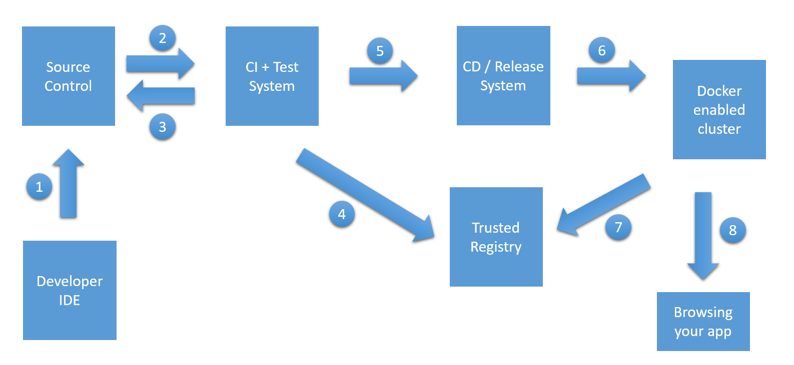

# Azure Container Service Training

Welcome on the Azure Container Service training page!

You will find below a list of training that you can use to get started with several topics around containers, Azure Container Services and DevOps!

## Docker Swarm

### Available trainings

1. Deploy Docker Swarm Mode cluster using ACS Engine: [here](swarm/deploy-acs-engine.md)
2. Docker Swarm: from your local machine to Azure Container Service: [here](swarm/docker-local-to-azure.md)

## Continuous Integration and Continuous Deployment

Containers are great for building CI/CD pipelines in order to deliver new features continuously in an application. 
The concepts are the same for all the orchestrators you are going to use:

1. Code changes are committed to the source code repository (for example, GitHub)
2. GitHub triggers a build in a CI system (for example VSTS or Jenkins)
3. The CI builds the Docker images
4. The CI pushes the Docker images into an image registry (for example Docker Hub or Azure Container Registry)
5. The CI system triggers a new deployment to a CD system (for example VSTS or Jenkins)
6. The CD systems asks the orchestrator to deploy a new version of the application (using a compose file, a bash script…)
7. The orchestrator pulls the new images versions
8. The orchestrator starts a new version of the application

### Available trainings

1. Create a full CI/CD pipeline for Docker Swarm using Visual Studio Team Service: [here](ci-cd/vsts_swarm.md)