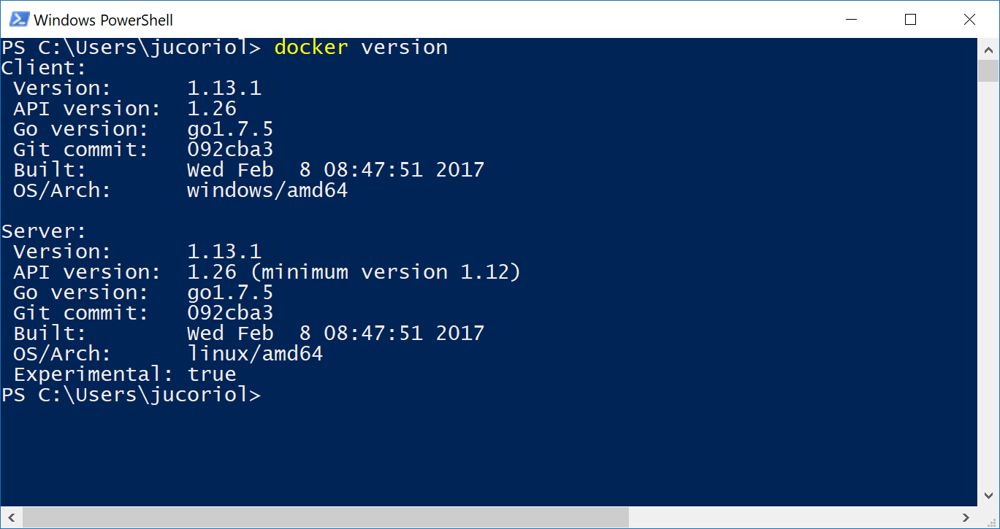
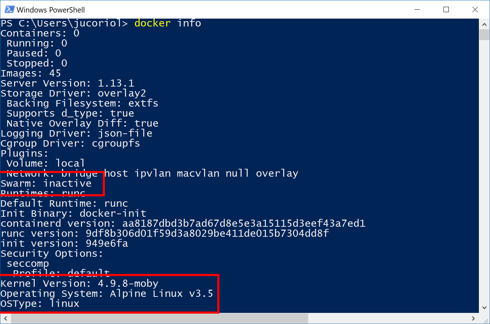
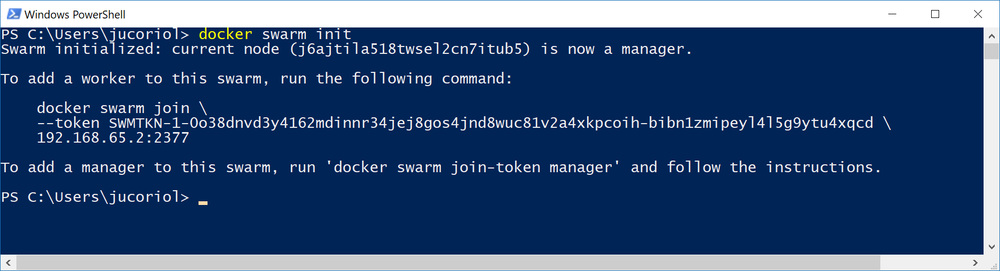
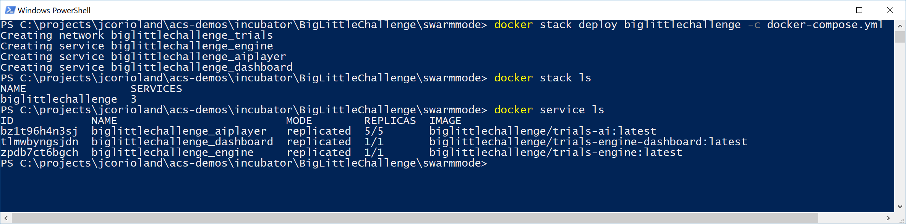
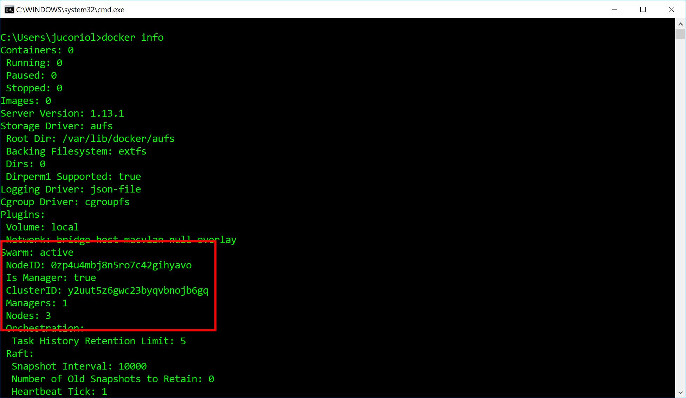
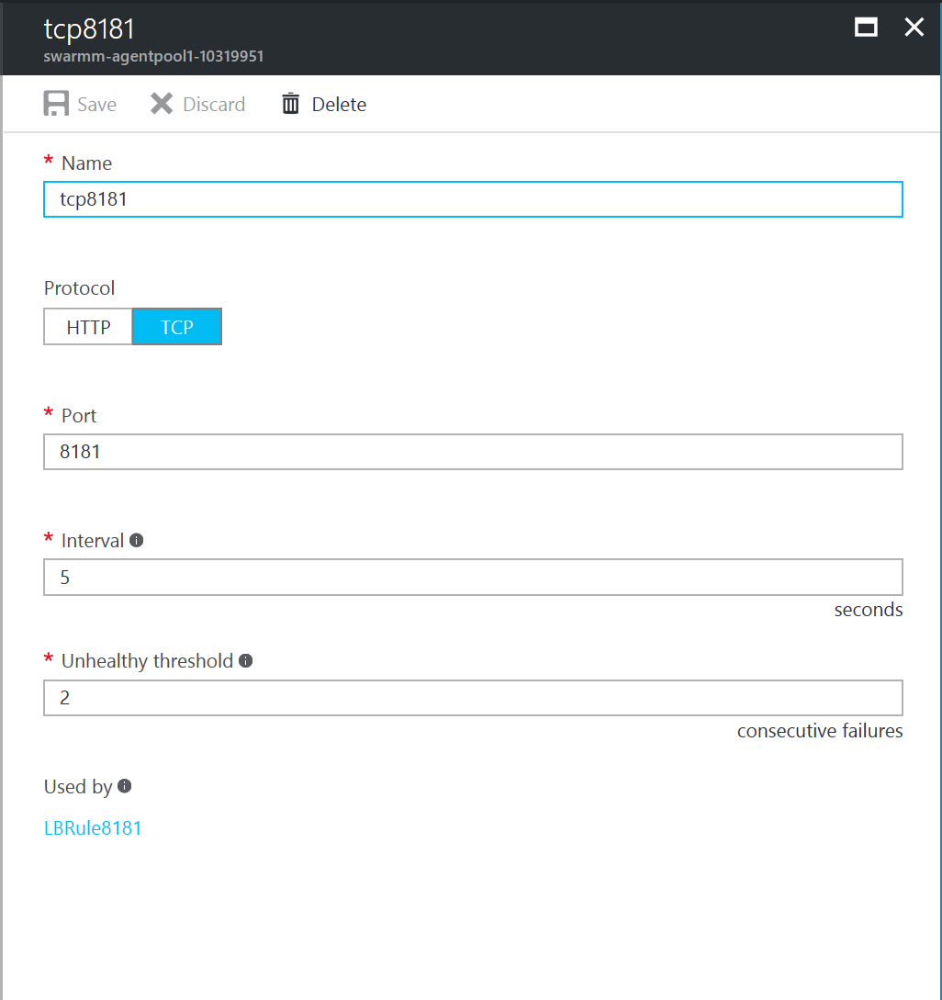
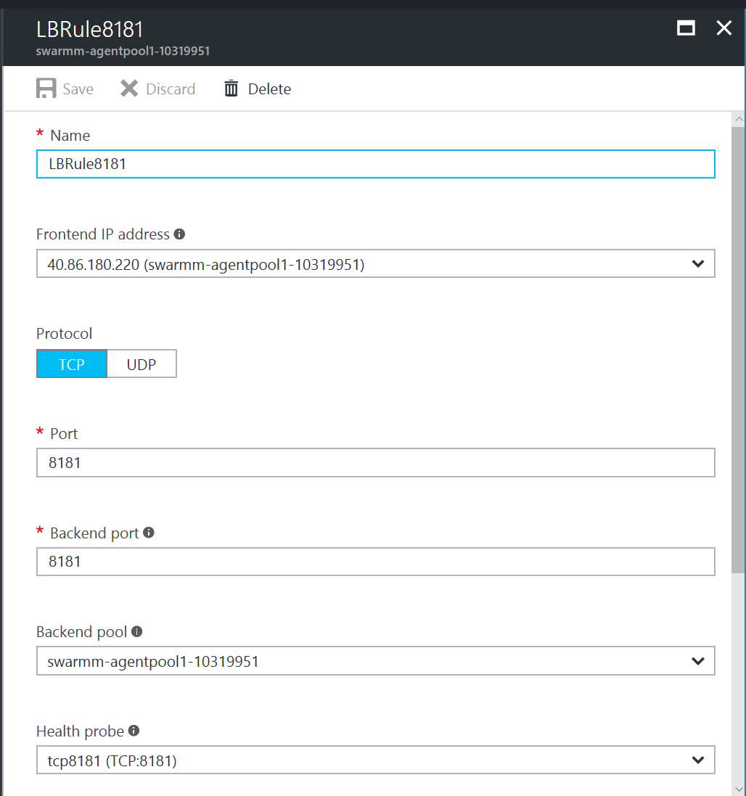
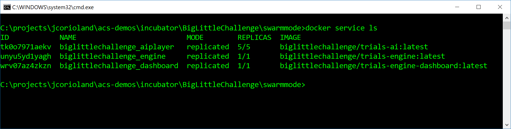
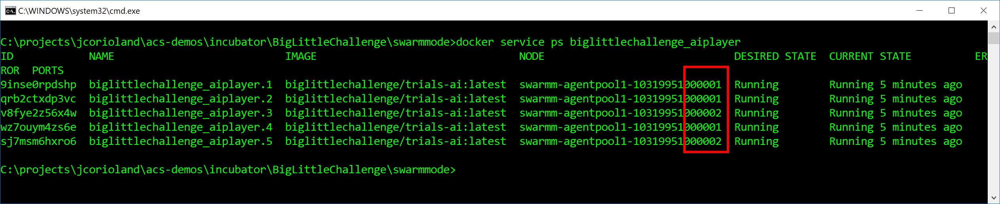

# Docker Swarm: from your local machine to Azure Container Service

## Introduction

In this training, you are going to learn:

- How to enable Swarm mode in your local environment
- How to deploy the multi-containers BigLittleChallenge application in your local environment
- How to deploy the same application in a Swarm mode cluster deployed with ACS Engine

## Prerequisites

Before getting started you need to:

- Install [Docker for Windows](https://docs.docker.com/docker-for-windows/) or [Docker for Mac](https://docs.docker.com/docker-for-windows/) depending on the machine you are working with
- Deploy a Swarm mode cluster using ACS Engine: [here](deploy-acs-engine.md)
- Clone or fork the [ACS Demos repository](https://github.com/azure/acs-demos)

## Enable Swarm mode in your local environment

Once you have installed Docker for Windows or Docker for Mac, you can check that all is ok using the command:

```
docker version
```




Or the command:

```
docker info
```




Since a few version, Docker Swarm has been integrated into the Docker CLI and into the Docker engine and it is now called **Swarm mode**.

You can enable it with the command:

```
docker swarm init
```




Your machine is now ready, running a one-node Swarm mode cluster.


## Run the application in your local environment

Browse the [incubator/BigLittleChallenge/swarmmode directory](../../incubator/BigLittleChallenge/swarmmode) that contains a docker-compose.yml file:

```yaml
version: '3'
networks:
  trials:
    driver: overlay
services:
  engine:
    image: biglittlechallenge/trials-engine
    networks:
      - trials
    ports:
      - "8080:8080"
    environment:
      MIN_NUMBER_OF_PLAYERS: 5
    deploy:
      mode: replicated
      replicas: 1
  aiplayer:
    image: biglittlechallenge/trials-ai
    networks:
      - trials
    ports:
      - "8888"
    depends_on:
      - engine
    deploy:
      mode: replicated
      replicas: 5
  dashboard:
    image: biglittlechallenge/trials-engine-dashboard
    networks:
      - trials
    ports: 
      - "8181:80"
    depends_on:
      - engine
      - aiplayer
    deploy:
      mode: replicated
      replicas: 1
```

This file defines the stack that you want to run into Swarm. A stack is a collection of services that are composed by one or more containers, across the cluster. It indicates on which ports the services should be exposed and how many replicas (containers) should be deployed per service.

It also defines an overlay network - **trials** - that will be used by all the services so they can communicate between each other.
The image used here are those that have been pushed on the Docker Hub: https://hub.docker.com/r/biglittlechallenge/

If you want, you can build your own images locally, following this documentation.

To start this stack, you need to use the command:

```
docker stack deploy biglittlechallenge -c docker-compose.yml
```

Where biglittlechallenge is the name of the stack.

Once done, it's possible to list the stacks running using the command:

```
docker stack ls
```

And also listing the services using:

```
docker service ls
```




It may be a little while until all the replicas are up and running because for the first time, the local Docker engine needs to pull the images from the Docker hub.

Now, just browse the Docker virtual machine IP address on the port 8181 (that is exposed by the trials-engine-dashboard service) and you should see the application running.


## Deploy the application on a Swarm mode cluster in Microsoft Azure

Now that your application is running on your local environment you might want to deploy it into a Swarm mode cluster running in Microsoft Azure.

The thing is that it is super easy to do that, with the EXACT same commands than you ran the application on your machine.

First, you need to create an SSH tunnel to be able to connect one of the master node of your cluster. The procedure to create an SSH tunnel may vary depending on the OS you are running on. 
[This training](deploy-acs-engind.md) will help you to get the job done.

Once you have the SSH tunnel up and running and that you have defined the **DOCKER_HOST** environment variable to the forwarded port, you can check that you are working with the Swarm endpoint in Azure by running a **docker info** command:




Then just run the docker stack deploy command as previously:

```
docker stack deploy biglittlechallenge -c docker-compose.yml
```

While Swarm is pulling the images on the nodes, you can go in the agent pool load balancer configuration in the Azure portal, to allow the http traffic on the port 8181 where the dashboard is running.

First, you need to add an health probe:




Then, a load balancing rule that uses this health probe:




And now you can check that all the services have been deployed in the Swarm mode cluster, using the command:

```
docker service ls
```




You may also want to have more details about a service, for example to see on which agents the containers are running. You can do it using the **docker service ps SERVICE_NAME** command:




The Big Little Challenge application is now running in the Docker Swarm cluster on Microsoft Azure in the exact same way it is running in your one-node cluster on your development machine.